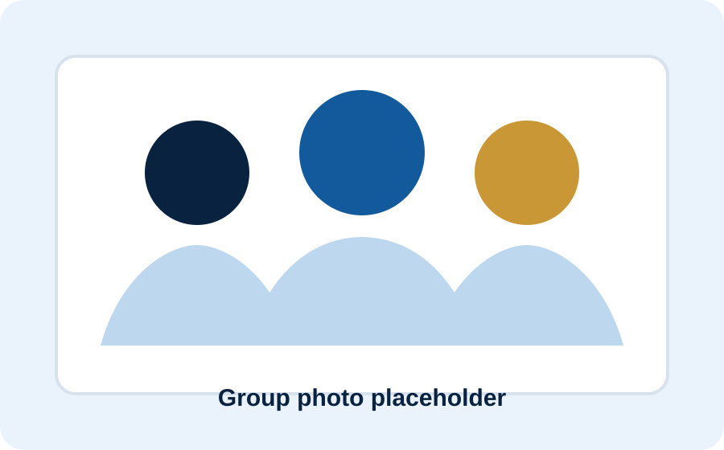

# GitHub Pages Research Group Website 完整操作指南

这个代码包是一个完整的 research group website 模板，适合用于大学老师、实验室、课题组、研究团队或 PhD supervisor 的 group website。

网站不需要服务器，不需要数据库，不需要 React，不需要复杂配置。它是纯静态网页，可以直接部署到 GitHub Pages。

---

## 1. 文件结构说明

解压后你会看到：

```text
research_group_github_pages_complete/
├── index.html              # 首页
├── research.html           # 研究方向页面
├── people.html             # 团队成员页面
├── publications.html       # 论文页面
├── projects.html           # 项目页面
├── news.html               # 新闻页面
├── openings.html           # 招生/招聘页面
├── contact.html            # 联系方式页面
├── assets/
│   ├── css/
│   │   └── style.css       # 所有网页样式
│   ├── js/
│   │   └── main.js         # 手机菜单、返回顶部按钮等
│   └── img/
│       ├── hero-network.svg
│       ├── group-photo-placeholder.svg
│       ├── avatar-lead.svg
│       ├── avatar-student.svg
│       └── avatar-researcher.svg
├── README.md
├── CUSTOMIZE.md
├── GUIDE_CN.md
├── .nojekyll
└── CNAME.example
```

---

## 2. 最简单的部署方式：GitHub 网页端上传

### Step 1：创建 GitHub repository

登录 GitHub，点击右上角 `+` → `New repository`。

如果想做个人/团队主站，repository 名字建议用：

```text
username.github.io
```

例如，如果 GitHub 用户名是 `abc-lab`，repository 可以叫：

```text
abc-lab.github.io
```

网站地址会是：

```text
https://abc-lab.github.io
```

如果想做一个项目网站，repository 可以叫：

```text
research-group-website
```

网站地址通常会是：

```text
https://username.github.io/research-group-website/
```

---

### Step 2：上传文件

进入新建的 repository 后：

1. 点击 `Add file`
2. 点击 `Upload files`
3. 把本文件夹里的所有内容拖进去

注意：要上传 `index.html`、`research.html`、`assets` 文件夹等，不要只上传 zip 压缩包。

正确结构应该是：

```text
repository root/
├── index.html
├── research.html
├── people.html
├── assets/
│   ├── css/
│   ├── js/
│   └── img/
```

不要变成：

```text
repository root/
└── research_group_github_pages_complete/
    ├── index.html
    └── assets/
```

如果变成这样，GitHub Pages 可能找不到首页。

---

### Step 3：开启 GitHub Pages

进入 repository：

```text
Settings → Pages
```

在 `Build and deployment` 里选择：

```text
Source: Deploy from a branch
Branch: main
Folder: /root
```

然后点击 `Save`。

等待 1–3 分钟，页面上会显示网站链接。

---

## 3. 本地预览方式

### 方法 1：直接打开

双击 `index.html` 可以直接在浏览器里预览。

### 方法 2：用 Python 本地服务器

如果电脑安装了 Python，可以在文件夹里运行：

```bash
python -m http.server 8000
```

然后浏览器打开：

```text
http://localhost:8000
```

这种方式更接近真实网站运行效果。

---

## 4. 如何修改网站内容

### 4.1 修改课题组名称

在所有 `.html` 文件里搜索：

```text
Research Group Name
```

替换成真实课题组名称，例如：

```text
Example Interdisciplinary Research Group
```

---

### 4.2 修改学校和院系名称

搜索：

```text
Department / School Name
University / Institution Name
```

替换成真实内容，例如：

```text
Department of Computer Science
University of Example
```

---

### 4.3 修改首页大标题

打开 `index.html`，找到：

```html
<h1>Research Group Name</h1>
```

修改为：

```html
<h1>Example Research Group</h1>
```

再修改下面这段：

```html
<p class="hero-subtitle">
  We develop evidence-driven methods, computational tools and interdisciplinary systems
  to address important scientific, engineering and societal challenges.
</p>
```

改成真实课题组介绍。

---

### 4.4 修改研究方向

打开 `research.html` 或 `index.html`，搜索：

```text
Core Research Themes
```

或：

```text
Research directions
```

然后替换四个研究方向卡片。

建议格式：

```html
<article class="theme-card">
  <span class="theme-number">01</span>
  <h3>Research Theme Title</h3>
  <p>Brief description of this research theme.</p>
</article>
```

---

### 4.5 修改团队成员

打开 `people.html`，找到：

```text
Professor / Dr Full Name
PhD Student Name
Postdoctoral Researcher Name
MSc Student Name
```

替换成真实姓名、职位和简介。

如果要增加一个人，复制这一块：

```html
<article class="profile-card">
  
  <h3>New Member Name</h3>
  <p class="role">Role</p>
  <p>Short biography or research topic.</p>
</article>
```

---

### 4.6 修改论文列表

打开 `publications.html`，找到：

```html
<article class="publication">
```

每篇论文都是一个 `article`。

格式如下：

```html
<article class="publication">
  <span class="pub-year">2026</span>
  <div>
    <h3>Paper Title</h3>
    <p><strong>Group Lead</strong>, Author A, Author B. <em>Journal Name</em>.</p>
    <p class="pub-links"><a href="#">Paper</a> <a href="#">Code</a></p>
  </div>
</article>
```

把 `#` 替换成真实链接。

---

### 4.7 修改新闻

打开 `news.html`，找到：

```html
<article>
  <span class="timeline-date">June 2026</span>
  <h2>Website launched</h2>
  <p>This placeholder research group website is now ready for GitHub Pages deployment.</p>
</article>
```

复制这个结构，增加新消息即可。

---

### 4.8 修改联系方式

打开 `contact.html` 和每个页面底部 footer，搜索：

```text
group.email@example.edu
group.lead@example.edu
Building / Office / Campus Address
```

替换成真实邮箱和地址。

---

## 5. 如何替换图片

图片都在：

```text
assets/img/
```

目前使用的是 SVG 占位图。

如果你有真实照片，例如：

```text
group-photo.jpg
```

可以放到：

```text
assets/img/group-photo.jpg
```

然后在 HTMD 里把：

```html

```

改成：

```html

```

建议图片尺寸：

```text
团队合照：900 × 560 px 或更大
头像：正方形，例如 400 × 400 px
首页图片：1000 × 650 px 或更大
```

---

## 6. 如何修改颜色

打开：

```text
assets/css/style.css
```

顶部有：

```css
:root {
  --navy: #09223f;
  --blue: #125a9c;
  --sky: #eaf3fb;
  --gold: #c99735;
}
```

如果想换颜色，主要改这里即可。

例如想改成绿色风格：

```css
--navy: #12372a;
--blue: #436850;
--sky: #eef7f0;
--gold: #ad8b3a;
```

---

## 7. 如何绑定自定义域名

如果对方有自己的域名，例如：

```text
www.example-lab.com
```

步骤：

1. 把 `CNAME.example` 改名为：

```text
CNAME
```

2. 文件里面写：

```text
www.example-lab.com
```

3. GitHub repository 里进入：

```text
Settings → Pages → Custom domain
```

4. 输入域名并保存。
5. 在域名服务商那里配置 DNS。

如果没有自定义域名，不需要管 `CNAME.example`。

---

## 8. 推荐后续修改顺序

建议按这个顺序交给对方修改：

```text
1. 替换 Research Group Name
2. 替换 Institution / Department
3. 修改首页简介
4. 修改 Research 页面
5. 修改 People 页面
6. 修改 Publications 页面
7. 修改 Contact 页面
8. 上传真实图片
9. 检查手机端显示
10. 部署到 GitHub Pages
```

---

## 9. 常见问题

### Q1：为什么打开网站显示 404？

通常是因为：

```text
1. 没有上传 index.html
2. index.html 不在 repository 根目录
3. GitHub Pages 没有开启
4. branch 或 folder 选错了
5. GitHub Pages 还没部署完成
```

---

### Q2：为什么 CSS 样式不显示？

检查路径是否正确：

```html
<link rel="stylesheet" href="assets/css/style.css">
```

同时确认 repository 里确实有：

```text
assets/css/style.css
```

---

### Q3：为什么图片不显示？

检查图片路径，比如：

```html

```

确认文件真的在：

```text
assets/img/hero-network.svg
```

---

### Q4：如何让网站更像正式大学课题组网站？

建议增加：

```text
1. 真实 group photo
2. 真实成员头像
3. 真实 publication DOI 链接
4. 真实 funder logo
5. 真实 collaboration institution logo
6. News 页面定期更新
7. Contact 页面加入办公室地址和地图
```

---

## 10. 最终交付建议

给对方交付时，可以说：

```text
I have prepared a complete GitHub Pages research group website template.
It includes multiple pages, responsive design, placeholder content, image placeholders,
a Chinese setup guide, and editing instructions. You can upload the files directly to
a GitHub repository and enable GitHub Pages.
```
